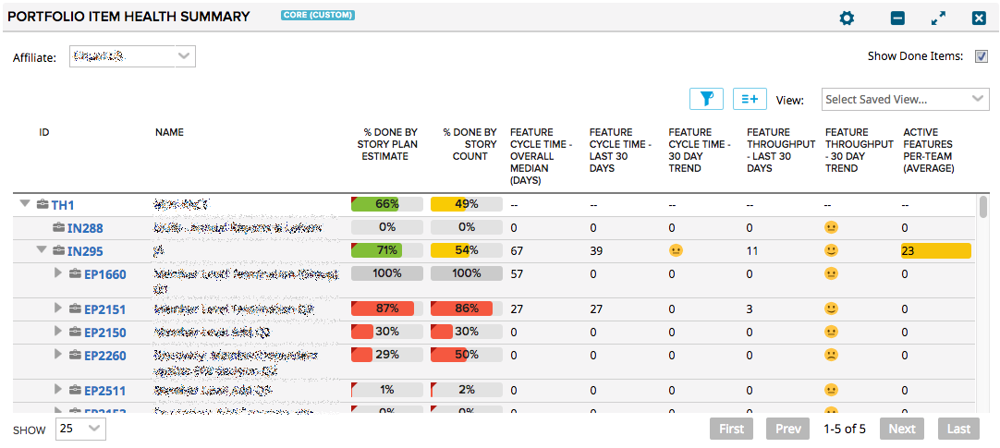

# Project Health Summary

## Summary/Description

This app shows portfolio item metrics based on the Features below that portfolio item.

First, a top-level PI is selected (called "Afflicate" in this case which maps to a Agile
Central "Group" PI type). Then the next level down PIs are shown in a tree. These root
items do not calculate metrics.

### Metrics
Expand a PI to see its descendent PIs and their metrics:
1. **Cycle Time Overall Median** - Calculate the number of days between ActualStartDate and ActualEndDate
for all features below the PI. Display the median value.
1. **Cycle Time - Last N Days** - Display the Median cycle time for all Features that have an ActualEndDate
within the prior N days. The feature may have started long ago, but finished within the last N days.
1. **Cycle Time - N Day Trend** - Compare the median cycle time from the most recent N day period with the value for the
N day period before that. If the median is getter lower, display a smile icon; if the same, a neutral icon; if worse a
sad icon.
1. **Throughput - Last N Days** - Count the number of Features that have an ActualEndDate within the last N days.
1. **Throughput - N Day Trend** - Compare the throughput in the last N day period with the N day period before that. If
throughput is increasing, display a smile icon; if the same, a neutral icon; if worse a sad icon.
1. **Active Features Per-Team (Average)** - For each PI, count the number of Features with an ActualStartDate but no ActualEndDate.
Also, count the number of teams of the "allowed" types (see settings) that are in the project hierarcy at or below the project
that owns the PI. Divide the number of active features by the number of teams below the PI owning project. Highlight values
larger than a desired threshold (see settings).

### Settings
* **Trend Time Period (Days)** - Set the number of days to use when computing trend metrics
* **Show Trend Values** - include the raw values in addition to the trend icons
* **Project Team Types...* - Select the values from the Project.c_TeamType attribute that should be included when counting
teams for the **Active Features Per-Team** metric.
* **Max "Active Features Per-Team"** - Set the threshold for the number of features per team. Values at or above this will
be highlighted in the chart.
* **Show Active Features and Team counts** - Show the raw values for the Active Features Per-Team metric.

## Version History
* 0.0.1 - Initial version for basic testing
* 1.0.0 - Filter by done items. Exclude project types from WIP. Configurable cell data.

## Useage Notes
* Use page settings to set a global scope.
* Use app settings to enable additional trend and active feature metrics information.

### First Load

If you've just downloaded this from github and you want to do development,
you're going to need to have these installed:

 * node.js
 * grunt-cli
 * grunt-init

Since you're getting this from github, we assume you have the command line
version of git also installed.  If not, go get git.

If you have those three installed, just type this in the root directory here
to get set up to develop:

  npm install

#### Deployment & Tests

If you want to use the automatic deployment mechanism, be sure to use the
**makeauth** task with grunt to create a local file that is used to connect
to Rally.  This resulting auth.json file should NOT be checked in.

### Structure

  * src/javascript:  All the JS files saved here will be compiled into the
  target html file
  * src/style: All of the stylesheets saved here will be compiled into the
  target html file
  * test/fast: Fast jasmine tests go here.  There should also be a helper
  file that is loaded first for creating mocks and doing other shortcuts
  (fastHelper.js) **Tests should be in a file named <something>-spec.js**
  * test/slow: Slow jasmine tests go here.  There should also be a helper
  file that is loaded first for creating mocks and doing other shortcuts
  (slowHelper.js) **Tests should be in a file named <something>-spec.js**
  * templates: This is where templates that are used to create the production
  and debug html files live.  The advantage of using these templates is that
  you can configure the behavior of the html around the JS.
  * config.json: This file contains the configuration settings necessary to
  create the debug and production html files.  
  * package.json: This file lists the dependencies for grunt
  * auth.json: This file should NOT be checked in.  This file is needed for deploying
  and testing.  You can use the makeauth task to create this or build it by hand in this'
  format:
    {
        "username":"you@company.com",
        "password":"secret",
        "server": "https://rally1.rallydev.com"
    }

### Usage of the grunt file
#### Tasks

##### grunt debug

Use grunt debug to create the debug html file.  You only need to run this when you have added new files to
the src directories.

##### grunt build

Use grunt build to create the production html file.  We still have to copy the html file to a panel to test.

##### grunt test-fast

Use grunt test-fast to run the Jasmine tests in the fast directory.  Typically, the tests in the fast
directory are more pure unit tests and do not need to connect to Rally.

##### grunt test-slow

Use grunt test-slow to run the Jasmine tests in the slow directory.  Typically, the tests in the slow
directory are more like integration tests in that they require connecting to Rally and interacting with
data.

##### grunt deploy

Use grunt deploy to build the deploy file and then install it into a new page/app in Rally.  It will create the page on the Home tab and then add a custom html app to the page.  The page will be named using the "name" key in the config.json file (with an asterisk prepended).

You can use the makeauth task to create this file OR construct it by hand.  Caution: the
makeauth task will delete this file.

The auth.json file must contain the following keys:
{
    "username": "fred@fred.com",
    "password": "fredfredfred",
    "server": "https://us1.rallydev.com"
}

(Use your username and password, of course.)  NOTE: not sure why yet, but this task does not work against the demo environments.  Also, .gitignore is configured so that this file does not get committed.  Do not commit this file with a password in it!

When the first install is complete, the script will add the ObjectIDs of the page and panel to the auth.json file, so that it looks like this:

{
    "username": "fred@fred.com",
    "password": "fredfredfred",
    "server": "https://us1.rallydev.com",
    "pageOid": "52339218186",
    "panelOid": 52339218188
}

On subsequent installs, the script will write to this same page/app. Remove the
pageOid and panelOid lines to install in a new place.  CAUTION:  Currently, error checking is not enabled, so it will fail silently.

##### grunt watch

Run this to watch files (js and css).  When a file is saved, the task will automatically build, run fast tests, and deploy as shown in the deploy section above.

##### grunt makeauth

This task will create an auth.json file in the proper format for you.  **Be careful** this will delete any existing auth.json file.  See **grunt deploy** to see the contents and use of this file.

##### grunt --help  

Get a full listing of available targets.
